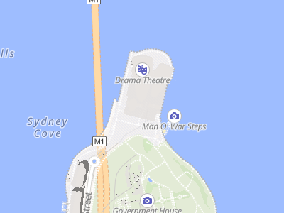
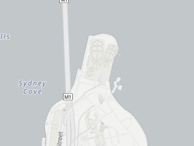

# mlnative

[](https://pypi.org/project/mlnative/)
[](LICENSE)

Render static map images from Python using [MapLibre Native](https://github.com/maplibre/maplibre-native).

**Platform:** Linux x64, ARM64  
**Python:** 3.12+

Uses the [maplibre-native](https://crates.io/crates/maplibre-native) Rust crate for high-performance native rendering.

## Quick Start

```bash
pip install mlnative
```

```python
from mlnative import Map
from geopy.geocoders import ArcGIS

# Geocode an address
geolocator = ArcGIS()
location = geolocator.geocode("San Francisco")

# Render map at that location
with Map(512, 512) as m:
    png = m.render(
        center=[location.longitude, location.latitude],
        zoom=12
    )
    open("map.png", "wb").write(png)
```

## Features

- **Zero config** - Works out of the box with OpenFreeMap tiles
- **HiDPI support** - `pixel_ratio=2` for sharp retina displays
- **Batch rendering** - Efficiently render hundreds of maps
- **Address geocoding** - Built-in support via geopy
- **Custom markers** - Add GeoJSON points, lines, polygons

## Screenshots

### Map Styles

Different [OpenFreeMap](https://openfreemap.org/) styles (rendered from "Sydney Opera House"):

**Liberty (default)** | **Positron (light)** | **Dark Matter**
:---:|:---:|:---:|
 |  | 

Styles from [OpenFreeMap](https://openfreemap.org/)

### HiDPI / Retina Rendering

Same location, different pixel ratios:

**Standard (1x)** | **HiDPI (2x)**
:---:|:---:
 | 
*400x300 px* | *800x600 px*

Both displayed at 200px width. The 2x version has 4x more pixels for sharper details.

Both images show the exact same geographic area. The 2x version has 4x more pixels for sharper text and details on retina displays.

## Examples

### Render from address

```python
from mlnative import Map
from geopy.geocoders import ArcGIS

geolocator = ArcGIS()
location = geolocator.geocode("Sydney Opera House")

with Map(512, 512) as m:
    png = m.render(
        center=[location.longitude, location.latitude],
        zoom=15
    )
```

### Fit bounds to show area

```python
from mlnative import Map, feature_collection, point

# Show multiple locations
markers = feature_collection([
    point(-122.4194, 37.7749),  # SF
    point(-122.2712, 37.8044),  # Oakland
])

with Map(800, 600) as m:
    # Load style as dict to modify it
    style = {"version": 8, ...}  # your style
    m.load_style(style)
    m.set_geojson("markers", markers)
    
    # Fit map to show all markers
    center, zoom = m.fit_bounds(
        (-122.5, 37.7, -122.2, 37.9),  # xmin, ymin, xmax, ymax
        padding=50
    )
    png = m.render(center=center, zoom=zoom)
```

### Batch render multiple cities

```python
from geopy.geocoders import ArcGIS

geolocator = ArcGIS()

# Geocode multiple cities
cities = ["London", "New York", "Tokyo"]
locations = [geolocator.geocode(city) for city in cities]

# Create views for each city
views = [
    {"center": [loc.longitude, loc.latitude], "zoom": 10}
    for loc in locations
]

with Map(512, 512) as m:
    pngs = m.render_batch(views)  # Returns list of PNG bytes
    # pngs[0] = London, pngs[1] = New York, pngs[2] = Tokyo
```

### HiDPI / Retina rendering

Use `pixel_ratio` to render high-resolution images for crisp display on retina/HiDPI screens.

```python
from geopy.geocoders import ArcGIS

geolocator = ArcGIS()
location = geolocator.geocode("Paris")

# Standard display (1x) - 512x512 image
with Map(512, 512, pixel_ratio=1) as m:
    png = m.render(
        center=[location.longitude, location.latitude],
        zoom=13
    )

# Retina/HiDPI display (2x) - 1024x1024 image
with Map(512, 512, pixel_ratio=2) as m:
    png = m.render(
        center=[location.longitude, location.latitude],
        zoom=13
    )
    # Same geographic area, but text appears sharper
```

**Key points:**
- `pixel_ratio=2` creates an image 2x larger in each dimension (4x total pixels)
- Shows the exact same geographic area as `pixel_ratio=1`
- Text, icons, and lines are rendered sharper, not smaller
- Common values: 1 (standard), 2 (retina), 3 (ultra-HD)

## API Reference

### Map(width, height, pixel_ratio=1.0)

Create map renderer. Context manager ensures cleanup.

**Parameters:**
- `width`, `height`: Output dimensions in CSS/logical pixels
- `pixel_ratio`: Scale factor for HiDPI (1=normal, 2=retina, 3=ultra-HD)
  - Output image dimensions will be `width × pixel_ratio` by `height × pixel_ratio`
  - Geographic coverage remains the same regardless of pixel_ratio

### render(center, zoom, bearing=0, pitch=0)

Render single view. Returns PNG bytes.

- `center`: `[longitude, latitude]`
- `zoom`: 0-24
- `bearing`: Rotation in degrees (0-360)
- `pitch`: Tilt in degrees (0-85)

### render_batch(views)

Render multiple views efficiently.

```python
views = [
    {"center": [lon, lat], "zoom": z},
    {"center": [lon, lat], "zoom": z, "geojson": {"markers": {...}}},
]
```

### fit_bounds(bounds, padding=0, max_zoom=24)

Calculate center/zoom to fit bounding box.

```python
center, zoom = m.fit_bounds((xmin, ymin, xmax, ymax))
png = m.render(center=center, zoom=zoom)
```

### set_geojson(source_id, geojson)

Update GeoJSON source in style (requires dict style, not URL).

```python
m.set_geojson("markers", {"type": "FeatureCollection", "features": [...]})
```

### load_style(style)

Load custom style (URL, file path, or dict).

```python
# OpenFreeMap styles
m.load_style("https://tiles.openfreemap.org/styles/liberty")
m.load_style("https://tiles.openfreemap.org/styles/positron")

# MapLibre demo
m.load_style("https://demotiles.maplibre.org/style.json")

# Custom style dict
m.load_style({"version": 8, "sources": {...}, "layers": [...]})
```

## GeoJSON Helpers

```python
from mlnative import point, feature_collection, from_coordinates, from_latlng

# Create point
sf = point(-122.4194, 37.7749, {"name": "San Francisco"})

# From coordinate tuples
fc = from_coordinates([(-122.4, 37.8), (-74.0, 40.7)])

# From GPS (lat, lng) order
fc = from_latlng([(37.8, -122.4), (40.7, -74.0)])
```

## Notes

### pixel_ratio and HiDPI rendering

The `pixel_ratio` parameter controls the resolution of the output image:

| pixel_ratio | Output size | Use case |
|-------------|-------------|----------|
| 1 | 512x512 → 512x512 | Standard displays |
| 2 | 512x512 → 1024x1024 | Retina/HiDPI displays |
| 3 | 512x512 → 1536x1536 | Ultra-HD displays |

- Higher `pixel_ratio` = larger output image
- Same geographic area shown regardless of pixel_ratio
- Text and icons scale properly (sharper, not smaller)
- fit_bounds() automatically accounts for pixel_ratio

### Other notes

- **Default style**: OpenFreeMap Liberty (no configuration needed)
- **GeoJSON updates**: Requires style loaded as dict, not URL
- **Platform**: Linux only (macOS/Windows builds disabled due to upstream issues)

## License

Apache-2.0
